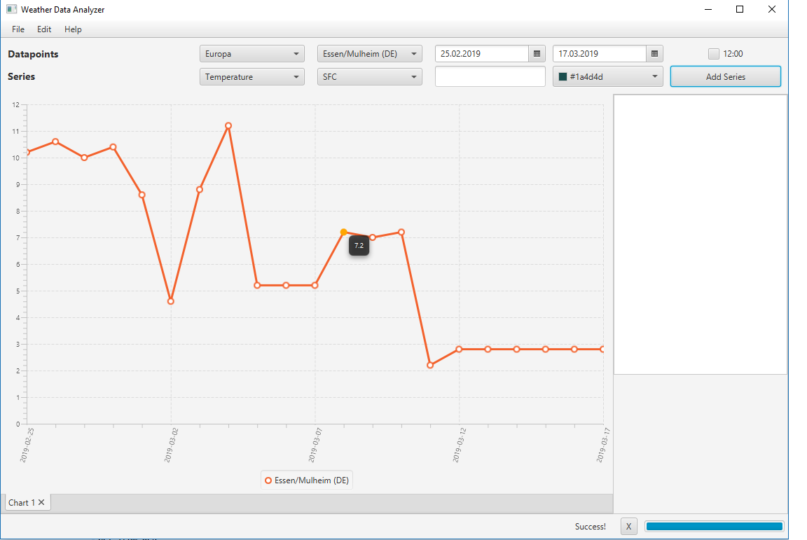

# WeatherDataVisualizer
Visualizer for Weather Sounding Data

Fetches Data from Web - http://meteocentre.com/radiosonde - and stores them locally.
Ability to Plot various associated Paramaters visually.

This programm enables the user to fetch Weather Data from Sounding Probes via the http://meteocentre.com/radiosonde Website.

The User chooses an area and is presented with all available stations within that area (first and second Picker in the first row dubbed "Datapoints"). The following two DatePickers enable the User to choose a timeframe of which he wishes to get the data. Certain possibilities will be excluded. This includes the fact that an end date can't be before a start date and both dates have to be at least the same day as the current day.
The following Checkbox gives the user to define which dataset of a given day he want´s to import. There are two possibilities because probes are launched at 0:00 local time and 12:00 local time. If the Checkbox is unchecked the programm fetches the 0:00 data.

The second line dubbed "Series" enables the user to specify the parameters he want's to plot. The first picker gives control over the measured parameter whereas the second picker gives control over the pressurelevel at which said measurement was taken. 

The TextField will be used to create a userdefined name for the choosen parameters and the ColorPicker will be used to change the color of the series to be created.

The Button "Add Series" will only be available if all parameters which are neccessary to create a series are input by the user as to avoid any non valid input.

The Listview on the right will display every series which is present in the active tab to further manipulate them.

The Tab Area is a LineChart representation of the chosen parameters each Series is presented as a line. Missing data points are extrapolated as to avoid gaps in the graph.

The Menu presents the user with an option to add Tab´s to the GUI as to plot multiple different stations or parameters to different LineCharts. Each Tab has it´s own dataset of series.
